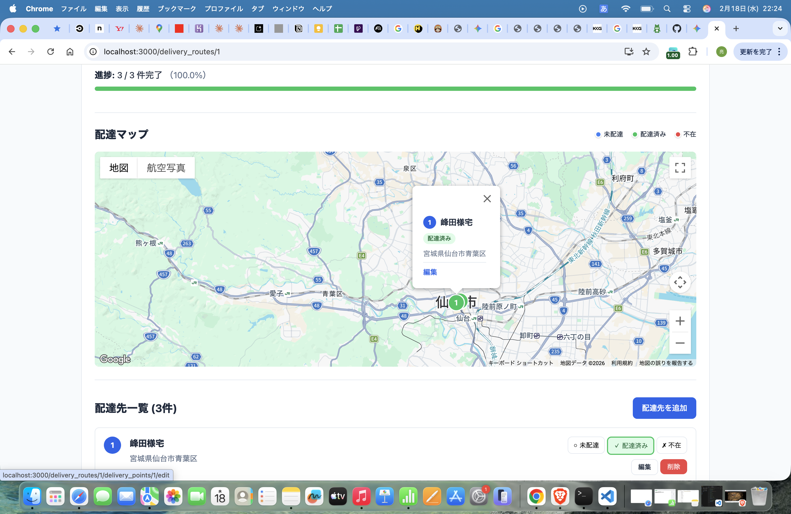
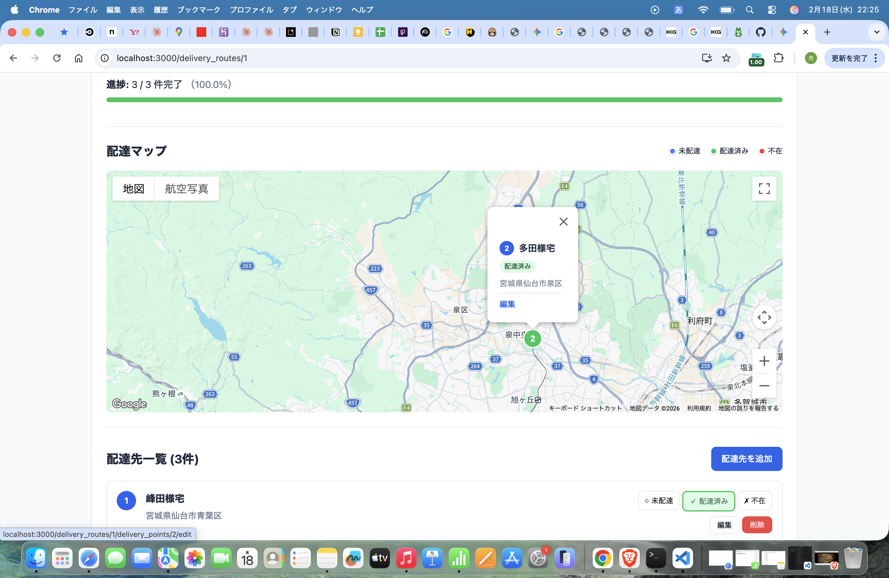
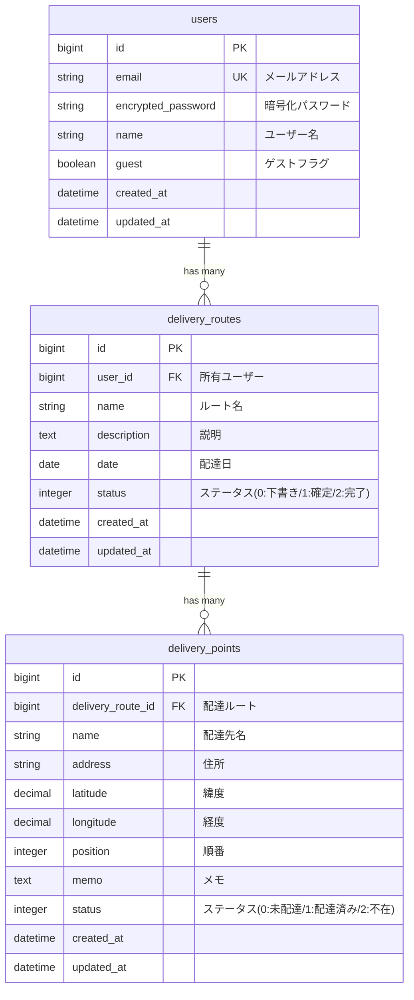

# 配達ルート最適化アプリ

## 🚀 デモ

**URL**: https://delivery-route-bell-f560356e7990.herokuapp.com/

> ゲストログインボタンですぐに試せます！

## スクリーンショット

### 配達マップ


配達先の位置をマーカーで表示。ステータス別に色分け（青：未配達、緑：配達済み、赤：不在）。

### マーカー詳細


マーカーをクリックすると配達先の詳細情報を表示。編集ボタンから直接編集可能。

配達員の効率的なルート計画を支援するWebアプリケーションです。

## 概要

このアプリケーションは、配達業務を行う方々の日々のルート管理をサポートします。配達先の登録、ルートの作成、配達状況の管理をシンプルな操作で行えます。

### 特徴

- **シンプルなUI** - 直感的な操作で配達ルートを管理
- **リアルタイム進捗管理** - 配達状況をワンクリックで更新
- **ゲストログイン** - アカウント登録なしですぐに試用可能
- **レスポンシブデザイン** - スマートフォンでも快適に操作
- **日本語対応** - 完全日本語ローカライズ

## 技術スタック

| カテゴリ | 技術 |
|---------|------|
| バックエンド | Ruby 3.3.3 / Rails 7.2 |
| データベース | PostgreSQL |
| フロントエンド | Hotwire (Turbo + Stimulus) |
| CSS | バニラCSS（CSS変数使用） |
| 認証 | Devise |
| インフラ | Heroku対応 |

## 機能一覧

### 認証機能
- ユーザー登録・ログイン・ログアウト
- パスワードリセット
- ゲストログイン（ワンクリックで試用）

### 配達ルート管理
- ルートの作成・編集・削除
- ルート名・配達日・説明の設定
- ステータス管理（下書き / 確定 / 完了）
- 配達進捗の可視化（プログレスバー）

### 配達先管理
- 配達先の追加・編集・削除
- 配達先名・住所・メモの登録
- ステータス切り替え（未配達 / 配達済み / 不在）
- 配達順序の管理

## ER図



## セットアップ

### 必要な環境

- Ruby 3.3.3
- PostgreSQL 14以上
- Bundler

### ローカル開発環境

```bash
# リポジトリをクローン
git clone <repository-url>
cd delivery_route_app

# 依存関係をインストール
bundle install

# データベースをセットアップ
rails db:create
rails db:migrate

# 開発サーバーを起動
rails server

# ブラウザでアクセス
open http://localhost:3000
```

### Herokuへのデプロイ

```bash
# Heroku CLIでログイン
heroku login

# アプリ作成
heroku create your-app-name

# PostgreSQLアドオン追加
heroku addons:create heroku-postgresql:essential-0

# 環境変数設定
heroku config:set RAILS_MASTER_KEY=$(cat config/master.key)
heroku config:set RAILS_SERVE_STATIC_FILES=true

# デプロイ
git push heroku main

# データベースマイグレーション（自動実行）
# Procfileのreleaseで自動実行されます
```

### 環境変数

| 変数名 | 説明 | 必須 |
|--------|------|------|
| `RAILS_MASTER_KEY` | credentials復号キー | 本番環境 |
| `RAILS_SERVE_STATIC_FILES` | 静的ファイル配信 | 本番環境 |
| `DATABASE_URL` | データベース接続URL | 本番環境（Heroku自動設定） |
| `APP_HOST` | アプリケーションホスト名 | 本番環境（メール用） |

## 開発コマンド

```bash
# サーバー起動
rails server

# コンソール起動
rails console

# データベースマイグレーション
rails db:migrate

# ルーティング確認
rails routes

# セキュリティチェック
bin/brakeman

# コードスタイルチェック
bin/rubocop
```

## ディレクトリ構成

```
app/
├── controllers/
│   ├── application_controller.rb    # 共通コントローラー
│   ├── home_controller.rb           # トップページ
│   ├── delivery_routes_controller.rb # 配達ルートCRUD
│   ├── delivery_points_controller.rb # 配達先CRUD
│   └── sessions/
│       └── guest_controller.rb      # ゲストログイン
├── models/
│   ├── user.rb                      # ユーザーモデル
│   ├── delivery_route.rb            # 配達ルートモデル
│   └── delivery_point.rb            # 配達先モデル
└── views/
    ├── home/                        # トップページ
    ├── delivery_routes/             # 配達ルート画面
    └── delivery_points/             # 配達先画面
```

## ライセンス

このプロジェクトは [MIT License](LICENSE) の下で公開されています。

## 作者

川島亮

ポートフォリオプロジェクト
